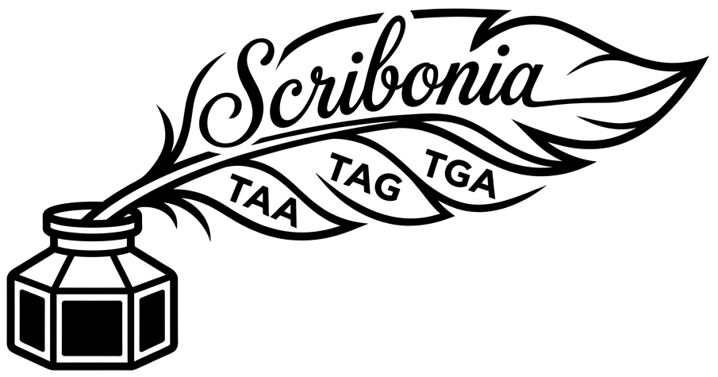

# Scribonia: Fast estimation of the genetic-code stop set of genomes and metagenomic bins

<p align="center">
  
</p>

$$\tiny\color{#d8d8d8}\text{Logo generated by Gemini}$$

Author: Katharina J. Hoff, University of Greifswald, Germany.

Some protists read one or two of the stop codons TAA, TAG, TGA as amino
acids. Scribonia tells from the DNA alone which of them end translation, in
about a second per megabase. It reports the stop set and its canonical NCBI
table.

## Method in brief

Scribonia needs no gene prediction, no protein alignment and no reference
database. For each of the 7 possible stop sets (non-empty subsets of TAA, TAG,
TGA) it cuts all six reading frames into stop-to-stop runs and keeps the runs
that are longer than random sequence of the same composition would produce;
these look like genes. A true stop codon is almost absent inside such runs
(depletion), and treating it as a stop leaves the genes intact (coverage). A
codon that is read as an amino acid is used inside the runs at the expected
rate, and treating it as a stop breaks them. From these and related statistics,
including votes of single contigs of at least 5 kb, Scribonia computes 130
features per input.

A trained classifier turns the features into a call: for each codon, 10
gradient-boosted tree models give the probability that the
codon is a stop. They were trained on simulated bins of genomes with
published codes and of standard genomes recoded to other stop sets, each
model on a bootstrap sample of genera. The three probabilities are decoded
jointly into the most probable stop set that has an NCBI table. Details:
[How it works](docs/method.md).

## Install and run

Scribonia runs from the container image `gaiusaugustus/scribonia` with
Singularity (default, recommended) or Docker, or from a pip install. All three
run the same command:

```bash
scribonia classify genome.fa -o result.tsv
```

* `classify`: estimate the stop set of a genome assembly or a metagenomic
  bin. Several FASTA files can be given at once (`scribonia classify *.fa`);
  the table then has one row per file.
* `genome.fa`: input FASTA file (plain or gzipped).
* `-o result.tsv`: output table. Without `-o` the table goes to stdout.

Two optional flags only put labels into the first two columns of the table.
They do not change the result; they help to tell rows apart when you
classify many files and concatenate the tables:

* `--sample NAME`: free text written into the `sample` column, e.g. the
  metagenome or project the file came from. Empty if not given.
* `--bag NAME`: free text written into the `bag` column, e.g. the bin or
  species name. Without it the file name is used. Only allowed with a single
  input file.

```bash
scribonia classify bin07.fa --sample lake_2020 --bag Tetrahymena -o result.tsv
```

The output columns are explained in [docs/usage.md](docs/usage.md#output).

### Singularity / Apptainer

```bash
singularity pull scribonia.sif docker://gaiusaugustus/scribonia:0.1.1
singularity run scribonia.sif classify genome.fa -o result.tsv
```

* `singularity pull scribonia.sif docker://...`: download the Docker image
  once and convert it into the single file `scribonia.sif`.
* `singularity run scribonia.sif ...`: run the image's entry point
  (`scribonia`) with the arguments that follow.
* Singularity runs as your user and mounts your home and the current
  directory automatically. Add `-B /path/to/data` after `run` for files
  elsewhere, e.g.
  `singularity run -B /scratch scribonia.sif classify /scratch/genome.fa`.
* `singularity exec scribonia.sif scribonia classify ...` is equivalent, with
  the command named explicitly. `apptainer` takes the same arguments.

### Docker

```bash
docker run --rm -u $(id -u):$(id -g) -v "$PWD":/data -w /data \
    gaiusaugustus/scribonia:0.1.1 \
    classify genome.fa -o result.tsv
```

* `--rm`: delete the container when it exits.
* `-u $(id -u):$(id -g)`: run as your own user, so that `result.tsv` belongs
  to you and not to root.
* `-v "$PWD":/data`: make the current directory visible inside the container
  as `/data`. Input and output files must be under this directory.
* `-w /data`: start in `/data`, so that relative paths such as `genome.fa` work.
* `gaiusaugustus/scribonia:0.1.1`: image and version tag.
* Everything after the image is passed to `scribonia`, because the image's
  entry point is the `scribonia` command.

### pip

```bash
pip install .
scribonia classify genome.fa -o result.tsv
```

`pip install .` needs numpy only, but then the shipped model cannot be
loaded and Scribonia falls back to the rule-based classifier with a warning.
`pip install ".[train]"` adds scikit-learn and joblib, which the shipped
model needs (it was trained with scikit-learn 1.9.1; other versions load it
with a version warning) and which `scribonia train` needs.

## Limitations

Scribonia reports the stop codons that end translation in the bulk of the
input. It was built for metagenomic bins and assemblies of protists of at
least 1 Mb. Known failures, with the evidence in the
[benchmark](docs/benchmark.md) and the [experiments](docs/experiments.md):

* **Contaminated assemblies.** The call can be the contaminant's stop set.
  Two Pseudokeronopsis assemblies with long foreign contigs are called
  standard, although the ciliate reads TAA and TAG as Gln
  ([details](docs/benchmark.md#pseudokeronopsis-contaminated-assemblies)).
* **Assemblies of gene-sized chromosomes** (contig N50 of a few kb, as in
  the macronuclear genomes of spirotrich ciliates). Only contigs of at least
  5 kb take part in the per-contig vote, so a few long contigs can decide
  the call. `contamination_flag` is raised for 17 of the 18 ciliate
  assemblies of the stopCR benchmark, so it carries no information there.
  It does not separate clean from contaminated bins elsewhere either
  ([details](docs/discarded_ideas.md#contamination-flag-from-contig-votes)).
* **Codons that both encode an amino acid and terminate.** Such a codon is
  reported as a stop when it ends many genes, without a note that it is
  also read as an amino acid (TGA = Arg in stichotrich ciliates; TAA in
  Uronychia binucleata). Genomes without any dedicated stop codon
  (Condylostoma, Blastocrithidia, karyorelict ciliates) are called {TGA},
  because the output always keeps at least one stop codon.
* **Rarely used reassigned codons.** A genome that seldom uses its
  reassigned codons is called standard. In Acetabularia, TAA and TAG carry
  about 9 % of Gln, and the genome is called standard
  ([details](docs/benchmark.md#acetabularia)).
* **Small inputs.** Below about 300 kb the calls are unreliable
  ([details](docs/experiments.md#bin-size)).
* **Amino acids.** Scribonia does not infer which amino acid a reassigned
  codon encodes. `table` is the canonical NCBI table of the stop set.

## Documentation

* [Usage and output columns](docs/usage.md)
* [How it works](docs/method.md)
* [Accuracy and experiments](docs/experiments.md)
* [Comparison with Codetta and PhyloFisher](docs/benchmark.md)
* [Training](docs/training.md)
* [Genetic codes and training genomes](docs/genetic_codes.md)
* [Discarded ideas](docs/discarded_ideas.md)

## How to cite

There is no publication yet. Please cite the software with its version and
URL; [CITATION.cff](CITATION.cff) has the details (on GitHub: "Cite this
repository").

## Collaboration

Scribonia is developed in collaboration with the project
[Alg4Nut](https://www.alg4nut.uni-rostock.de/). Alg4Nut needs Scribonia
because rumen metagenomes are expected to contain organisms with non-standard
genetic codes. Alg4Nut is funded by the European Regional Development Fund
(ERDF) of the European Union within the ERDF programme 2021 to 2027 of the
State of Mecklenburg-Western Pomerania (1 April 2025 to 31 March 2029;
reference numbers EXF-25-1011 to EXF-25-1018).
