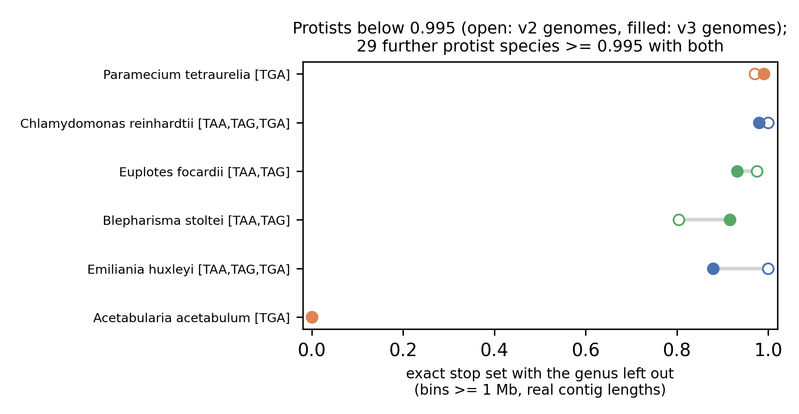
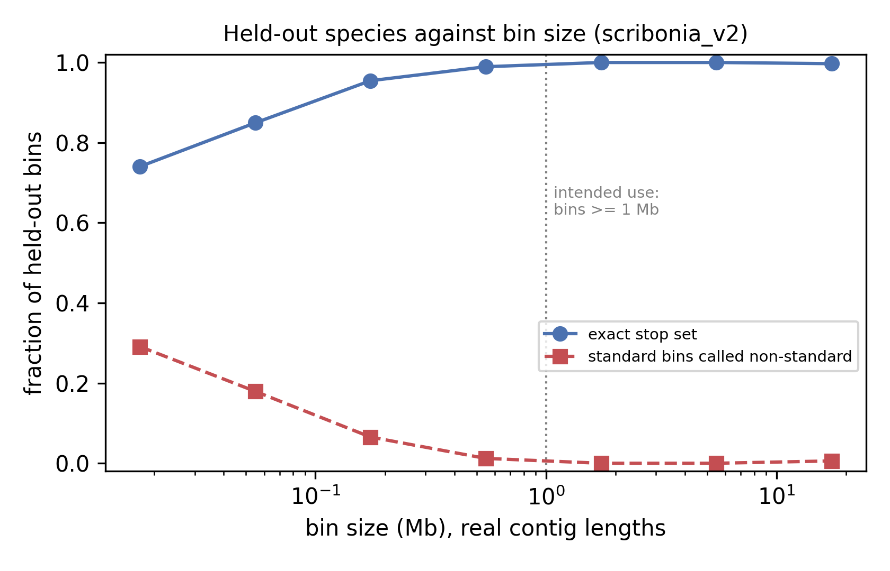

# Experiments and accuracy

This file covers how Scribonia is evaluated and what each model version
achieved. For ideas that were tried and dropped, see
[discarded_ideas.md](discarded_ideas.md). The genomes and their literature
are in [genetic_codes.md](genetic_codes.md).

## Evaluation protocol

**Bins.** `scribonia simulate` draws bin-like samples from labelled genomes:

* **Fragmentation.** Genomes are cut into contigs. Training bins use
  log-uniform lengths of 2–20 kb. Test bins use the real lengths of the 7,403
  contigs in the 150 bins of one metagenomic sample (median 10.5 kb,
  5–95 % range 4–56 kb, maximum 683 kb).
* **Bin size.** Log-uniform over 0.3–30 Mb for training. Test bins are at
  least 1 Mb, the smallest bins Scribonia is meant for. The size test goes
  down to 10 kb.
* **Contamination.** Up to 30 % of a bin comes from genomes of another stop
  set, including bacteria.
* **Recoded genomes.** Standard-code genomes whose annotated CDS were
  rewritten into {TAA,TAG} or {TAA,TGA} fill the thin classes. They are used
  only for training.

**Tests.**

* **Held-out species:** species never simulated into training (`HELDOUT` in
  `scripts/train.sbatch`). Genomes with ambiguous codes are always held
  out and scored apart.
* **Leave-genus-out cross-validation:** five folds over genera. Each bin is
  predicted by models fitted on the other genera. This is the honest measure
  for a bin from a lineage the model has not seen, which is the usual case
  in a metagenome. Held-out numbers can be optimistic: the held-out Euplotes
  crassus shares its genus with the training species Euplotes focardii.

**Metrics.**

* **Exact stop set:** the fraction of bins whose whole stop set is right.
* **Standard called non-standard:** the error that would make a gene finder
  read through real stop codons of a standard genome.
* **Non-standard missed:** a reassigned code called standard.

**Relevant population.** Scribonia is meant for metagenomic bins of at least
1 Mb from the clades in `data/stop_codon_clades.tsv`, the only ones in which
a nuclear stop codon is known to be reassigned. The headline numbers are
therefore for protist bins of at least 1 Mb. Animals, plants and fungi are
listed separately or left out.

## Summary and known limits

Current model: scribonia_v3, bins of at least 1 Mb.

| test | exact stop set | standard called non-standard | non-standard missed |
| --- | --- | --- | --- |
| held-out species (Acetabularia excluded) | 0.9996 | 0.1 % | 0 % |
| leave-genus-out, 35 species (see note below) | 0.988 | 0.6 % | 1.7 % |

Bins below about 300 kb are unreliable (see [Bin size](#bin-size)).

* **Genomes with no dedicated stop codon** (Condylostoma, Blastocrithidia,
  karyorelicts, Amoebophrya ex Karlodinium) are called {TGA}.
* **{TAA,TAG} genomes from an unseen genus** are the weakest class: 0.92–0.93
  with the genus left out. Only two real genera of this kind are in training.
* **Acetabularia** is labelled {TGA} in the literature, but its assembly looks
  standard to every feature. It is excluded from training (see
  [Acetabularia](#acetabularia)).

## Model versions

| version | change | held-out exact | leave-genus-out exact |
| --- | --- | --- | --- |
| rules | depletion + coverage-ratio thresholds (`rules.py`) | not scored | not scored |
| scribonia_v1 | one boosted-tree model per codon, isotonic calibration | 0.910 | – |
| v1 without calibration | same models, raw probabilities | 0.987 | 0.93 |
| scribonia_v2 | 10 models per codon on genus bootstraps, composition features out, joint decoding, coding-like-run features | 0.998 | 0.982 (2–20 kb test bins) |
| scribonia_v2, real contig lengths | same model, test bins with real lengths | 0.997 | 0.985 (protists ≥ 1 Mb) |
| **scribonia_v3** | v2 design, more genomes: diplomonads, aphelids, Obscuromonas, Giardia, Fabrea; votes from contigs ≥ 5 kb | **0.9996** (Acetabularia excluded) | **0.988** (protists ≥ 1 Mb) |

The v1 and v2 rows were scored on the held-out bins of their time: 2–20 kb
contigs, bins of at least 0.3 Mb. The last two rows use real contig lengths
and bins of at least 1 Mb.

## scribonia_v3 in detail

### Held-out species

All 18 species below were never simulated into training.

| species | stop set | bins | exact | calls |
| --- | --- | --- | --- | --- |
| Euplotes crassus | TAA,TAG | 498 | 1.000 | all TAA,TAG |
| Hexamita inflata | TGA | 264 | 1.000 | all TGA |
| Ichthyophthirius multifiliis | TGA | 263 | 1.000 | all TGA |
| Pseudocohnilembus persalinus | TGA | 254 | 1.000 | all TGA |
| Stentor coeruleus | standard | 168 | 1.000 | all standard |
| Entodinium bursa | standard | 194 | 1.000 | all standard |
| Entodinium caudatum | standard | 178 | 1.000 | all standard |
| Isotricha intestinalis | standard | 195 | 1.000 | all standard |
| Plasmodium falciparum | standard | 207 | 1.000 | all standard |
| Blastocystis hominis | standard | 199 | 1.000 | all standard |
| Danio rerio | standard | 179 | 0.994 | 1 bin TAA,TGA |
| Acetabularia acetabulum | TGA | 233 | 0.000 | all standard (see below) |
| Amoebophrya sp. ex Karlodinium | ambiguous | 24 | – | 24 TGA |
| Blastocrithidia nonstop | ambiguous | 35 | – | 35 TGA |
| Blastocrithidia triatomae | ambiguous | 21 | – | 21 TGA |
| Condylostoma magnum | ambiguous | 26 | – | 25 TGA, 1 TAA,TGA |
| Loxodes magnus | ambiguous | 32 | – | 32 TGA |
| Plagiopyla frontata | ambiguous | 30 | – | 29 TGA, 1 TAA,TGA |

Blastocystis is a useful negative control. About 15 % of its genes gain their
stop codon only through polyadenylation (Klimeš et al. 2014,
doi:10.1093/gbe/evu146), yet it is called standard in every bin.

### Leave-genus-out, protists

Real contig lengths, bins of at least 1 Mb. The test bins are the same for
both columns; only the training genomes differ.

| | v2 genomes | v3 genomes |
| --- | --- | --- |
| protist bins | 10,369 | 10,369 |
| exact stop set | 0.985 | 0.988 |
| standard called non-standard | 0.02 % | 0.6 % |
| non-standard missed | 2.5 % | 1.7 % |

**Species below 0.995 (v3 genomes).**

* **Blepharisma stoltei {TAA,TAG}:** 0.92, up from 0.80.
* **Euplotes focardii {TAA,TAG}:** 0.93, down from 0.975. These two are the
  only real {TAA,TAG} genera, so each is learned mostly from the other and
  from recoded genomes.
* **Emiliania huxleyi (standard):** 0.88. 12 % of its bins are called
  {TAA,TGA}. Haptophytes are not in the clade list, so a haptophyte bin
  with known taxonomy should not be classified at all.
* **Chlamydomonas reinhardtii (standard):** 0.98.
* **Paramecium tetraurelia {TGA}:** 0.99.

All 30 other species are at 0.995 or better with both sets of genomes.
Among animals and plants, Arabidopsis (0.97) and C. elegans (0.96) are
slightly below.

**Note on the species count.** The 35 species scored here as protists
include one that is not: the genome listed as *Perkinsus marinus* in the
results tables (`docs/results/`) is the yeast Candida tropicalis, because
the manifest carried that yeast's accession under the wrong name. The
mix-up was found after these runs; the manifest now names the genome
correctly. Its stop-set label (standard) was right, all of its bins were
called correctly, and the numbers above are unchanged by it apart from the
count of protist species, which is 34.

**New lineages with the genus left out.** The aphelid Amoeboaphelidium
protococcarum {TGA} scores 1.0, Spironucleus {TGA} 1.0, and Giardia,
Obscuromonas, Fabrea and A. occidentale (all standard) 1.0.

### Acetabularia

The literature labels Acetabularia {TGA}: TAA/TAG encode Gln (Cocquyt et al.
2010, doi:10.1186/1471-2148-10-327). Every bin of the public assembly
(GCA_963931725.1, contig N50 5 kb, no annotation) nevertheless looks
standard. TAA and TAG are depleted inside long runs (D = 0.13–0.20) about as
strongly as in Giardia (see the annotated cluster in `figures/depletion.png`).
Both suspected reasons hold (details in
[benchmark.md](benchmark.md#acetabularia)):

* The reassigned codons are rarely used. In the transcriptome, TAA/TAG carry
  about 9 % of Gln at conserved positions; Scribonia calls the transcriptome
  standard too.
* Much of the assembly is not Acetabularia nuclear DNA. It is a meta-assembly
  of amplified single-cell DNA covering 7–11 % of the genome; most of its
  conserved genes do not match the transcriptome.

Acetabularia is held out rather than trained on, because a standard-looking
{TGA} label would teach the model to call standard genomes {TGA}.

## Bin size

scribonia_v2 on held-out species, real contig lengths:

| bin size | bins | exact | standard called non-standard |
| --- | --- | --- | --- |
| 10–30 kb | 466 | 0.74 | 29 % |
| 30–100 kb | 1,234 | 0.85 | 18 % |
| 100–300 kb | 1,012 | 0.95 | 6.5 % |
| 0.3–1 Mb | 849 | 0.99 | 1.2 % |
| 1–3 Mb | 695 | 1.00 | 0 % |
| 3–10 Mb | 708 | 1.00 | 0 % |
| 10–30 Mb | 674 | 0.997 | 0.6 % |

Below 100 kb, most errors are Danio (little coding sequence per contig) and
Euplotes. Keeping only calls of joint probability ≥ 0.9 raises exact match on
10–300 kb bins to 0.975, but keeps only 40 % of them. Bins below 1 Mb are
outside the intended use. Training on small bins did not fix this (see
[discarded ideas](discarded_ideas.md#training-on-small-bins)).

## Contig lengths in training

Tested with leave-genus-out on protist bins of at least 1 Mb:

| training contigs | test contigs | exact |
| --- | --- | --- |
| 2–20 kb | real lengths | 0.973–0.985 |
| real lengths | real lengths | 0.956 |

The range 0.973–0.985 comes from two genome sets: the v2 genomes, and the v3
genomes without Acetabularia. Training on the idealised 2–20 kb contigs
generalises better to unseen genera, so training stays on 2–20 kb and the
real lengths are used only for testing.

## Reproducing

* **Official runs:** `scripts/submit_train.sh` or
  `scripts/train.sbatch`. Outputs go to
  `{VERSION,models,eval}/` under `SCRIBONIA_TRAIN_DIR`.
* **Leave-genus-out and the other experiments** follow the
  [evaluation protocol](#evaluation-protocol) above. The one-off scripts
  that ran them are not part of this repository; the tables in
  `docs/results/` hold their results.
* **Tables and figures:** `docs/results/extract.py` writes the
  tables in `docs/results/`; `docs/figures/make_figures.py` draws the figures
  from them.
