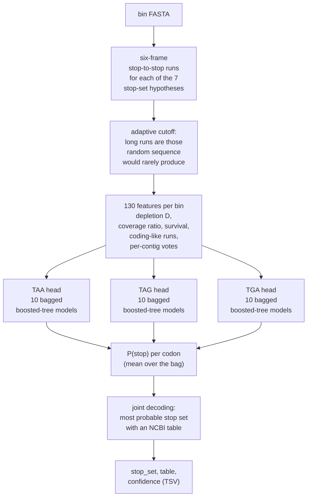
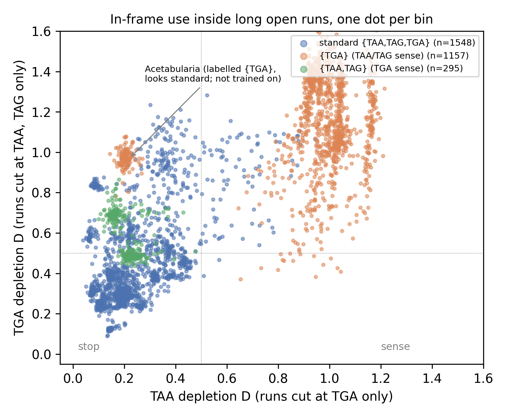

# How Scribonia works

1. **Hypotheses.** For each of the 7 non-empty subsets of {TAA, TAG, TGA},
   all six frames are cut into stop-to-stop runs.
2. **Long runs.** A run counts as long when random sequence of the same
   composition would rarely produce it. The cutoff is raised until such
   random runs are under 5 % of those observed, so the long runs look like
   genes.
3. **Features.** For each codon *c* and each hypothesis without *c*,
   Scribonia measures:
   * **Depletion D:** in-frame use of *c* inside the long runs, relative to the
     count expected from the position-specific composition. It is about 0 for
     a stop and about 1 for a sense codon.
   * **Coverage ratio:** how much of the genome lies in long runs free of *c*.
     A real stop leaves every gene intact; a sense codon breaks most of them.
   * **Survival:** the share of long runs that stay long when *c* is also
     treated as a stop.
   * **Coding-like runs:** the share of long runs whose composition depends on
     codon position, and depletion over those runs only. This keeps
     non-coding stretches of AT-rich or intron-rich genomes from passing as
     genes.
   * **Per-contig votes** from contigs of at least 5 kb.
4. **Model.** Each codon has one head of 10 gradient-boosted tree models
   (depth ≤ 4, monotone in the depletion features). Each model is fitted on a
   bootstrap sample of *genera*, and their outputs are averaged. The five
   genome-composition features are left out, so 125 features are used.
5. **Decoding.** The three probabilities are decoded jointly into the most
   probable stop set that has an NCBI table.

The trained model is loaded from `scribonia/models/` (file name `DEFAULT_MODEL`
in `scribonia/model.py`). Without it, a rule-based classifier
(`scribonia/rules.py`) takes over.

The main signal is depletion. Reassigned TAA/TAG (a {TGA} genome) stand out
clearly. Reassigned TGA (a {TAA,TAG} genome such as Euplotes or Blepharisma)
is subtler, which is why the model combines several features:

