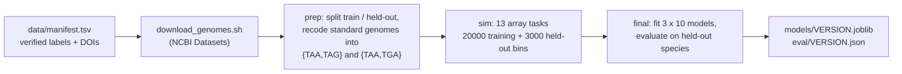

# Training



```bash
export SCRIBONIA_TRAIN_DIR=/path/to/train_dir       # and SBATCH_PARTITION if needed
bash scripts/download_genomes.sh data/manifest.tsv "$SCRIBONIA_TRAIN_DIR/genomes"
VERSION=scribonia_v3 bash scripts/submit_train.sh   # 13 nodes, ~30 min
# or, the same on one node:
sbatch scripts/train.sbatch                          # ~3.5 h
```

* **Manifest rows** are used only when their citation was checked
  (`verified = yes`).
* **Training bins** use contigs of 2–20 kb. **Held-out bins** use the real
  contig lengths of metagenomic bins and are at least 1 Mb.
* **Genomes** in the manifest and the literature behind the clade list are
  described in [genetic_codes.md](genetic_codes.md).
* **Evaluation** protocol and results are in [experiments.md](experiments.md).
